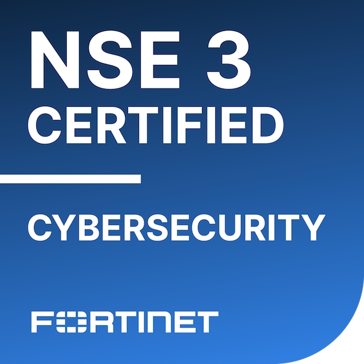

# Hi, I'm Alexis 👋

I am a UK-based **Junior Network and IT Engineer** working in a managed service provider environment, supporting network and IT infrastructure across multi-site hospitality environments.

I hold a **First Class BSc in Forensic Computing & Security from Bournemouth University**, the **Cisco Certified Network Associate (CCNA)** certification, and the **Fortinet NSE 3 in Cybersecurity** certification.

My professional development is focused on enterprise networking, Fortinet, Cisco Meraki, Windows Server, infrastructure monitoring, cybersecurity, and practical IT troubleshooting.

---

## Certifications

<table>
  <tr>
    <td align="center" width="50%">
      
    </td>
    <td align="center" width="50%">
      
    </td>
  </tr>
  <tr>
    <td align="center">
      <strong>Cisco Certified Network Associate (CCNA)</strong>
    </td>
    <td align="center">
      <strong>Fortinet NSE 3 in Cybersecurity</strong>
    </td>
  </tr>
</table>

---

## Current Role

In my role as a **Junior Network and IT Engineer**, I support and troubleshoot live customer environments involving:

- LAN, WAN, VLAN, and wireless connectivity
- Cisco Meraki MX, MS, and MR infrastructure
- Ruckus wireless networks
- WatchGuard firewalls and remote-access VPNs
- Windows Server and Active Directory
- Microsoft 365 administration and support
- PRTG monitoring and alert investigation
- Datto RMM and Autotask ticket management
- VoIP platforms, including 3CX and Mitel
- Virtual infrastructure using VMware and Proxmox
- Access points, switch ports, cabling, printers, and endpoints
- Technical communication with customers, vendors, and on-site engineers

This experience is helping me develop practical skills in troubleshooting, documentation, escalation, customer support, and infrastructure management within real production environments.

---

## Technical Skills

### Networking

- IPv4 addressing and subnetting
- LAN and WAN technologies
- VLANs and inter-VLAN routing
- Static and dynamic routing
- OSPF
- Spanning Tree Protocol
- EtherChannel
- HSRP
- NAT and PAT
- Access Control Lists
- DHCP and DNS
- DHCP Snooping
- Dynamic ARP Inspection
- Port Security
- Wireless troubleshooting
- RF configuration and optimisation
- Remote-access VPN troubleshooting
- Network monitoring and fault investigation

### Systems and IT Infrastructure

- Windows Server
- Active Directory
- Group Policy
- Microsoft 365
- User and access management
- Windows endpoint troubleshooting
- Printer and print-server support
- Virtual machines and hypervisors
- Remote monitoring and management
- VoIP and IP telephony
- Technical ticket management
- Vendor escalation and case management

### Platforms and Tools

- Cisco IOS
- Cisco Meraki Dashboard
- Fortinet FortiGate
- Ruckus
- WatchGuard
- EVE-NG
- Wireshark
- PRTG
- Datto RMM
- Autotask PSA
- Windows Server
- Active Directory
- Microsoft 365
- VMware
- Proxmox
- 3CX
- Mitel

---

## Education

**BSc (Hons) Forensic Computing & Security — First Class**  
Bournemouth University

My degree developed my understanding of:

- Digital forensics
- Cybersecurity principles
- Network security
- Incident investigation
- Secure infrastructure design
- Technical research
- Evidence-based troubleshooting
- Professional technical documentation

---

## What I'm Currently Developing

- Fortinet FortiGate administration and network security
- Firewall policies, NAT, and VPN technologies
- Cisco Meraki switching, wireless, and security appliances
- Enterprise wireless troubleshooting and optimisation
- Windows Server and Active Directory administration
- Microsoft 365 administration
- Network monitoring and incident response
- Virtualisation using VMware and Proxmox
- Structured troubleshooting across network and IT systems
- Clear technical documentation for support and engineering teams

---

## Career Direction

My goal is to continue developing as a **Network and IT Engineer** by gaining deeper hands-on experience across enterprise networking, wireless infrastructure, firewalls, Windows systems, virtualisation, monitoring, and cybersecurity.

I am particularly interested in work that combines structured troubleshooting, customer support, infrastructure improvement, secure network design, and the administration of business-critical IT services.
